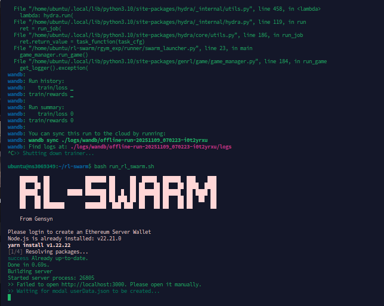
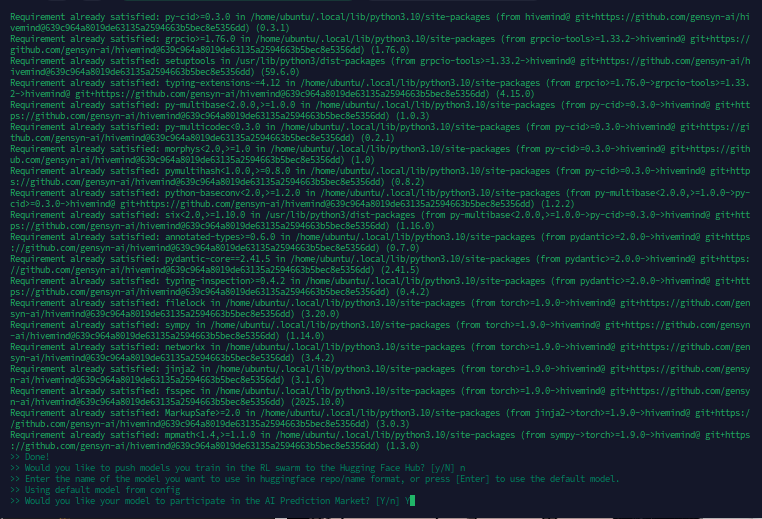
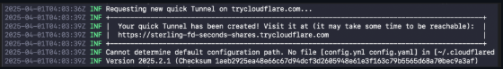

# 🧱 GENSYN RL-SWARM INSTALL GUIDE (CPU)

<p align="center">
  
</p>

A complete step-by-step guide to set up and run a **Gensyn RL-Swarm node (CPU-only)** on Ubuntu.  
Includes dependency setup, swarm import, environment fixes, and login access.

---

## 🪴 1️⃣ System setup
```bash
sudo apt update && sudo apt upgrade -y
sudo apt install -y sudo curl wget git jq make gcc lld build-essential ca-certificates bash-completion
sudo apt install -y python3 python3-pip python3-venv python-is-python3
```

---

## 🌱 2️⃣ Clone the repo
```bash
cd ~
git clone https://github.com/gensyn-ai/rl-swarm.git
cd rl-swarm


```


🧩 Import existing swarm file (optional)  
If you’ve previously run a node and already have a swarm file, import it here.  
Simply drag your existing swarm file into the `~/rl-swarm/swarm` folder.  
If skipped, a new swarm file will be auto-generated when you launch the swarm.

---

## ⚙️ 3️⃣ Node.js 22 + Yarn install
```bash
curl -fsSL https://deb.nodesource.com/setup_22.x | sudo -E bash -
sudo apt install -y nodejs
sudo npm install -g yarn
node -v && npm -v && yarn -v
```

Verify Python setup:
```bash
sudo apt install -y python-is-python3
python --version
```

---

## 🧩 4️⃣ Python environment sanity fix
```bash
sudo apt install -y python3-pip
pip install --upgrade jinja2
```
✅ Fixes the `jinja2 ≥ 3.1.0` transformer error.

---

## 🧠 5️⃣ Torch + core packages (CPU-only build)
```bash
pip install --no-cache-dir torch==2.2.2+cpu torchvision==0.17.2+cpu torchaudio==2.2.2+cpu -f https://download.pytorch.org/whl/torch_stable.html
```

---

## 🔮 6️⃣ Install main Gensyn + Hivemind stack
```bash
pip install --no-cache-dir \
  gensyn-genrl==0.1.11 \
  "hivemind@git+https://github.com/gensyn-ai/hivemind@a0963c04a8019de61335a294663b5bec8e3536d"
```

---

## 🔧 7️⃣ Permission & runtime fix (only once)
```bash
sudo chown -R $USER:$USER ~/rl-swarm
chmod -R 755 ~/rl-swarm
```
If you ever see:
```
sed: Permission denied
```
just re-run the two commands above.

---

## 🚀 8️⃣ Launch the swarm (inside a screen session)
To keep your node running even if you disconnect your SSH session, start it inside a screen.

```bash
screen -S gensyn
```

Then launch the swarm:
```bash
./run_rl_swarm.sh
```



---

## 🧠 Interactive prompts during launch

- It will prompt you to login:  
  👉 Follow [http://localhost:3000](http://localhost:3000)

- Push models to Hugging Face Hub?  
  **Enter N**

- Enter model name or press Enter for default:  
  **Press Enter**

- Participate in AI Prediction Market?  
  **Enter Y**



⚠️ If you manually enter a model name, it can cause your node to be terminated.  
✅ It’s strongly recommended to use the default model.  
If you still want to explore manual models, refer to **Choose customised models** for selection guidance.

🎉 Here we go — it’s done! ✅  
Your node will start generating logs soon 🙌


⚠️ You will see **error messages and warnings** appearing in the terminal log —  
these are normal and can be safely ignored.  
If you see new rounds or DHT messages scrolling, your node is working fine ✅

---

## 📶 How to access the login portal ([http://localhost:3000](http://localhost:3000))

If running on a VPS and you want to access the UI remotely:

Allow incoming connections:
```bash
sudo apt install ufw -y
sudo ufw allow 22
sudo ufw allow 3000/tcp
sudo ufw enable
```

Install Cloudflared tunnel:
```bash
wget -q https://github.com/cloudflare/cloudflared/releases/latest/download/cloudflared-linux-amd64.deb
sudo dpkg -i cloudflared-linux-amd64.deb
cloudflared --version
```

Make sure your node backend is running on port 3000, then run:
```bash
cloudflared tunnel --url http://localhost:3000
```



You’ll get a public HTTPS link to access your login page.

Now follow the login flow — done! ✅


---

## 🧩 9️⃣ (Optional) Check swarm connectivity
```bash
ps aux | grep rl_swarm
```

Or monitor logs:
```bash
tail -f ~/rl-swarm/logs/latest.log
```

You’ll see rounds, rewards, and DHT messages confirming connection.  

---

## 🧹 🔟 Clean-up helpers (optional)
To reclaim space from failed builds:
```bash
sudo docker system prune -af
sudo rm -rf ~/.cache/pip
```

---

## 🧠 Auto-start script (fixes startup timing)
Create a startup script to avoid backend timing issues.

### Step 1 — Create the script
```bash
nano ~/start-swarm.sh
```

Paste the following:
```bash
#!/bin/bash
set -e

echo "🚀 Starting Gensyn RL-Swarm full stack..."

# 1️⃣ Launch backend
echo "🧩 Launching modal-login backend on port 3000..."
cd ~/rl-swarm/modal-login
nohup yarn start -p 3000 > ~/modal-login.log 2>&1 &

# 2️⃣ Wait until backend is ready
echo "⏳ Waiting for backend to be ready..."
until curl -s http://localhost:3000/api/register-peer > /dev/null; do
  sleep 3
  echo "   ... still waiting ..."
done
echo "✅ Backend is online!"

# 3️⃣ Start RL-Swarm node
cd ~/rl-swarm
export PYTHONWARNINGS="ignore"
echo "🤖 Starting RL-Swarm node..."
python3 -m rgym_exp.runner.swarm_launcher +api.url=http://localhost:3000

echo "🎉 RL-Swarm node exited or stopped."
```

### Step 2 — Make it executable
```bash
chmod +x ~/start-swarm.sh
```

### Step 3 — Run it anytime
```bash
./run_rl_swarm.sh
```
---

## ✅ Done!
Your **Gensyn RL-Swarm node** should now be live and connected to the global swarm.

Monitor logs:
```bash
tail -f ~/rl-swarm/logs/latest.log
```


# 🔺 Upgrade to New Release (CodeZero) — Mac/Linux

## 1. Go to your gensyn screen (VPS)
```bash
screen -r gensyn
```

## 2. Stop your node
(Only if you are already inside the gensyn screen on VPS)  
Press:
```
ctrl + c
```

## 3. Move to rl-swarm directory
```bash
cd rl-swarm
```

## 4. Deactivate environment
```bash
deactivate
rm -rf .venv
```

## 5. Pull the latest release
```bash
git switch main
git reset --hard
git clean -fd
git pull origin main
```

## 6. Start the swarm node 🚀
```bash
python3 -m venv .venv
source .venv/bin/activate
...bash
./run_rl_swarm.sh
...


Stay synced — stay rewarded 💫
